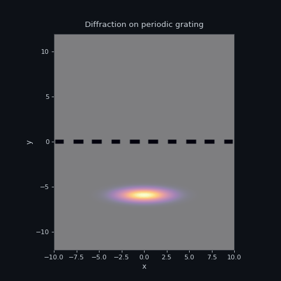

[](https://pypi.org/project/pytalises/)
[](https://anaconda.org/conda-forge/pytalises)
[](https://pypi.org/project/pytalises/)
[](https://github.com/savowe/pytalises/actions/workflows/ci.yml)
[](https://pytalises.readthedocs.io/en/latest/)


<div align="center">

# pyTALISES

**This Ain't a LInear Schrödinger Equation Solver**

*Split-step Fourier method for quantum wavefunction propagation*



</div>

## Quickstart

```python
import pytalises as pt

# Define a 1D grid
grid = pt.Grid(shape=(256,), extent=((-10, 10),))

# Create a Gaussian wavepacket
psi = pt.Wavefunction(initial="exp(-x**2)", grid=grid)

# Propagate freely for 1000 steps
psi.freely_propagate(steps=1000, dt=1e-4)
```

That's it. For coupled states, potentials, and GPU acceleration, see the [documentation](https://pytalises.readthedocs.io/).

## Installation

**pip**:
```bash
pip install pytalises
```

**With GPU support** (requires NVIDIA CUDA):
```bash
pip install pytalises[gpu]
```

## Why pyTALISES?

pyTALISES excels at **position-space wavefunction dynamics**:

- 🌊 **Matter-wave propagation** — free expansion, wavepacket dynamics
- 🔬 **Atom optics** — Bragg diffraction, beam splitters, interferometry
- ⚛️ **Cold atom physics** — BEC dynamics, nonlinear interactions
- 📡 **Light-matter coupling** — Rabi oscillations, Raman transitions
- 🎯 **Multi-level systems** — arbitrary internal state structure

If you need to propagate wavefunctions on spatial grids with time-dependent potentials, pyTALISES makes it simple.

## Features

- **Multi-dimensional grids** — 1D, 2D, 3D spatial simulations
- **Coupled internal states** — Two-level systems, Raman transitions, Bragg diffraction
- **String-based potentials** — Define V(x,t) as human-readable expressions
- **Performance** — FFTW, numba JIT, numexpr, multithreading
- **GPU acceleration** — Optional CuPy backend for large grids

## Examples

<details>
<summary><strong>Two-level Rabi oscillations</strong></summary>

```python
import pytalises as pt

grid = pt.Grid(shape=(256,), extent=((-4, 4),))
psi = pt.Wavefunction(
    initial=["exp(-x**2)", "0"],  # Start in ground state
    grid=grid,
)

# Coupling potential (off-diagonal drives transitions)
V = pt.HermitianPotential.from_lower_triangular([
    "0",              # V_11: ground state energy
    "Omega*cos(t)",   # V_21: coupling
    "Delta",          # V_22: excited state detuning
])

psi.propagate(
    potential=V,
    steps=1000,
    dt=1e-6,
    variables={"Omega": 2.0, "Delta": 0.0},
)
```

</details>

<details>
<summary><strong>GPU-accelerated propagation</strong></summary>

```python
import pytalises as pt

# Auto-detects GPU if available
psi.propagate(
    potential=V,
    steps=10000,
    dt=1e-6,
    options=pt.PropagationOptions(backend="auto"),
)

# Or explicitly:
options = pt.PropagationOptions(backend="cupy", dtype="complex128")
```

See the [GPU documentation](https://pytalises.readthedocs.io/en/latest/gpu_backend.html) for performance characteristics.

</details>

## Documentation

📖 **[Full documentation](https://pytalises.readthedocs.io/)**

Includes:
- [Usage examples](https://pytalises.readthedocs.io/en/latest/examples.html) — Gaussian wavepackets, harmonic potentials, BEC
- [Advanced examples](https://pytalises.readthedocs.io/en/latest/additional_examples.html) — Raman transitions, Bragg diffraction, atom interferometry
- [GPU backend guide](https://pytalises.readthedocs.io/en/latest/gpu_backend.html) — Installation, performance, troubleshooting
- [Algorithm notes](https://pytalises.readthedocs.io/en/latest/notes.html) — Split-step Fourier method explained

## Development

```bash
git clone https://github.com/savowe/pytalises.git
cd pytalises
pip install -e ".[dev]"
pytest tests/
```

## Citation

If you use pyTALISES in academic work, please cite:

```bibtex
@software{pytalises,
  author = {Vowe, Sascha},
  title = {pyTALISES: Split-Step Fourier Method for the Schrödinger Equation},
  url = {https://github.com/savowe/pytalises},
}
```

## License

GPLv3 — see [LICENSE](LICENSE).
